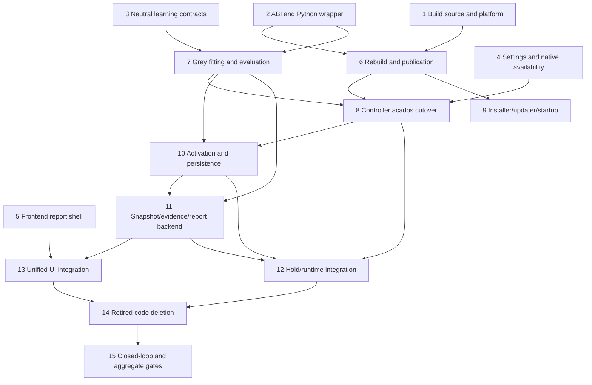

# Acados Grey-Box MPC Migration Implementation Plan

> **Required workflow:** Execute with subagent-driven development. Fan out only the tasks listed in the same wave; apply one focused implementation review per task before the next dependent wave. PiFire VCS operations use `jj`, never raw `git`. CMake FetchContent may use Git internally for its ignored build checkout.

**Goal:** Replace every production do-mpc, neural-policy, Scheduled ARX, innovation-state-space, and linear-MPC path with a generated acados grey-box solver while preserving asynchronous control, online grey-box learning, operator calibration, cook refitting, persistence, rollback, and the complete learning UI.

**Architecture:** PiFire owns one grey-only native ABI, a Python `AcadosGreyBoxMPC` wrapper, committed reviewed generated C, and a one-command rebuild. CMake FetchContent obtains the pinned upstream acados checkout under ignored build state; PiFire contains no acados submodule or vendored acados source. Runtime uses a fixed 25-second/eight-delay grey model and a configurable 5–24-stage horizon. Learning fits `C_c`, `K_Q`, and `theta` off the control worker and activates an estimator+solver pair only after durable persistence. One backend report is the authority for both the dashboard pill and panel.

**Authoritative design:** `docs/superpowers/specs/2026-08-09-acados-grey-box-mpc-migration-design.md`

**Upstream source identity:**

- URL: `https://github.com/acados/acados.git`
- Commit: `503364817c872d474ab5bed219c26760ac267769` (tagged v0.6.0 upstream)
- No PiFire `.gitmodules`, Gitlink, `vendor/acados`, prebuilt binary, or copied upstream source tree.
- Required upstream recursive dependencies may be populated only inside CMake's ignored FetchContent checkout. Record the resolved dependency revisions in provenance.

**Primary tools:** Python 3.14, C17, CMake 3.18+, FetchContent, ctypes, uv, SciPy, pytest, Bun/Vitest/Playwright.

---

## Locked Cross-Slice Contracts

These names and serialized values are fixed before parallel work starts. A task may refine internal implementation, but it must not invent a second spelling or compatibility alias.

### Native and Python contract

- Package: `controller.acados`.
- Public owner: `controller/acados/grey_box.py:AcadosGreyBoxMPC`.
- Config: `GreyBoxMPCConfig(..., horizon_steps: int)`; accepted range 5–24.
- Constants: prediction step `25.0`, delay states `8`, public state width `10`, generated state width `11`, maximum output capacity `24`.
- C ABI version: `2`.
- C output: fixed-capacity 24-entry arrays plus explicit `sequence_length`; unused tail is zero.
- C create validates structure before allocation, calls `pifire_grey_acados_create_with_discretization` with `N` copies of 25 seconds, and uses runtime `N` in every stage, terminal, parameter, warm-state, and result loop.
- Cost scaling: after variable-horizon creation, set every running-stage acados scaling value to `1.0`; terminal cost remains unchanged. Runtime `time_steps` must never silently scale the stage objective by 25.
- Publication root: ignored `controller/_native/`.
- Immutable releases: `controller/_native/releases/<build-digest>/libacados_pifire.{so,dylib}` and adjacent `build-manifest.json`.
- Single atomic selector: `controller/_native/current` points to one complete release. The loader resolves both library and manifest through that selector and verifies their digest agreement.
- Every missing-library, manifest, or ABI error names `./rebuild-acados.sh --if-needed`.

### Rebuild contract

- Public commands: `./rebuild-acados.sh` and `./rebuild-acados.sh --if-needed`; no other public build entry point.
- Full mode: lock → configure/fetch → generate into same-filesystem staging → provenance/equation/parity gates → compile → ABI/loader/horizon/cold/warm smoke → publish generated source → publish immutable runtime release → atomically replace `current`.
- Conditional mode: lock → compare value-based manifest inputs → no-op on exact match; otherwise compile the committed generated C without importing CasADi or regenerating models → smoke → publish a complete immutable release → atomically replace `current`.
- Staging and release roots share a filesystem. Failed generation, compile, smoke, fsync, or pointer replacement leaves the previous `current` release loadable.
- Committed generated provenance is `native/generated/manifest.json`; deployed evidence is the release-local `build-manifest.json`. Timestamps are informational, never staleness inputs.

### Runtime and learning contract

- One active pair owns `GreyBoxEKF | GreyBoxKF` plus `AcadosGreyBoxMPC`; no component can swap alone.
- `role_generation` crosses frame observation, fit request/result, evidence, persistence, and runtime swap. `candidate_generation` is distinct.
- Candidate origins: `passive-online`, `operator-calibration`, `cook-refit`.
- Activation policies/reasons: `passive-auto`, `operator-reviewed`, `cook-refit`.
- Passive automatic activation still requires all fit, bounds, identifiability, causal forecast, consecutive-win, confidence, feasibility, target-hardware timing, native dry-solve, durable persistence, and completed-frame swap gates.
- Operator-calibration candidates always stop at `ready-for-review`, even when passive auto-learning is enabled.
- Cook refit runs only when `enable_identification=true`; accepted output becomes active on next-cook restore, never by an end-of-cook live swap.
- One outstanding fit job, one process, single-threaded BLAS, bounded immutable input window. Every result rechecks origin, window, session/cook, config digest, incumbent digest, and role generation.
- Model snapshot schema: `MODEL_SCHEMA = 4`. New writers emit only v4. Compatible v3 is migration-only input; delay structure other than eight is rejected visibly.
- Evidence and trace schemas are bumped only where the serialized shape changes; no old linear payload is relabeled as grey evidence.

### Unified report contract

- Python projection: `controller/model_learning/report.py`.
- Live input: `controller/model_learning/contracts.py:LearningStatus`.
- Status values: `collecting`, `insufficient-excitation`, `fitting`, `evaluating`, `ready-for-review`, `activating`, `active`, `fallback`, `error`, `schema-invalidated`.
- Fit status: `idle`, `queued`, `running`, `succeeded`, `failed`, `stale`.
- Check status: `not-run`, `pending`, `passed`, `failed`.
- Report combines durable evidence rows, durable activation singleton, validated current checkpoint/live learning status, and calibration command high-water. Its cache key includes all four inputs.
- REST report remains the state authority. Socket data may carry only `learningReportRevision` to invalidate/refetch immediately.
- Manual activation request stays `{candidate_digest, decision_id}` and is legal only for `operator-reviewed`.
- Rollback request stays `{reason}`. POST responses are acknowledgements; the refreshed report provides final state.

---

## Execution Graph



**Parallel Wave 1:** Tasks 1–5.  
**Parallel Wave 2A:** Tasks 6 and 7 start concurrently after their shown prerequisites.  
**Parallel Wave 2B:** Tasks 8 and 9 start after their prerequisites; Task 8 waits for Tasks 6 and 7, while Task 9 waits only for Task 6.  
**Wave 3:** Task 10 after Task 8.  
**Wave 4:** Task 11 after Task 10.  
**Parallel Wave 5:** Tasks 12 and 13 after Task 11.  
**Wave 6:** Task 14 after Tasks 12 and 13.  
**Wave 7:** Task 15.

For every implementation task: write or update the named focused tests first; do not run project-wide formatters/linters/tests in subagents; review the task's exact diff; then the parent runs the focused commands listed for the wave. Commit only task-owned paths with a focused `jj commit -m ... <paths>` after review.

---

## Task 1: Establish FetchContent, Platform, and Grey Code Generation

**Owner boundary:** Build system and generated-source provenance only. Do not modify the runtime Python controller, learning pipeline, updater, or UI.

**Create:**

- `CMakeLists.txt`
- `cmake/AcadosPifirePlatform.cmake`
- `native/CMakeLists.txt`
- `native/AcadosPifireExports.cmake`
- `controller/acados/codegen/__init__.py`
- `controller/acados/codegen/grey_box_ocp.py`
- `controller/acados/codegen/manifest.py`
- `controller/acados/codegen/cli.py`
- `native/generated/manifest.json`
- `native/generated/grey_box/**`
- `tests/unit/acados/test_cmake_platforms.py`
- `tests/unit/acados/test_grey_box_definition.py`
- `tests/unit/acados/test_codegen.py`

**Modify:** `.gitignore`, `pyproject.toml`, and `uv.lock` for the isolated code-generation dependency group only. Keep do-mpc temporarily reproducible until Task 8 freezes the reference parity corpus; Task 14 owns final dependency removal.

**Reference source:** Import the existing platform mapping from `../acados/cmake/AcadosPifirePlatform.cmake` unchanged. Adapt only the grey half of `../acados/src/acados/codegen/*` and `../acados/native/generated/grey_box`; never copy `../acados/vendor`, `.gitmodules`, bootstrap script, linear generator, linear generated files, benchmark package, or wheel-vendoring configuration.

**Steps:**

1. Add failing platform tests for Linux x86_64 with/without AVX, Linux aarch64, Darwin x86_64/arm64, and fatal unsupported processors. Port the sibling test driver exactly.
2. Add failing provenance/codegen tests for the canonical URL/full pin, required recursive dependency revisions, locked Python generator versions, complete grey-only file hashes, deterministic check mode, path normalization, tree exchange, and failure-before-mutation.
3. Add the locked `codegen` dependency group matching the generated provenance and regenerate the lock. Keep CasADi/acados-template out of deployed default dependencies; the future full rebuild must invoke generation through `uv run --no-default-groups --group codegen`, while conditional mode never resolves or imports the group.
4. Import the platform module byte-for-byte and make root CMake consume its BLASFEO/HPIPM choices. Configure static dependency libraries, OpenMP on, examples/tests off.
5. Use `FetchContent_Declare(acados ...)` with the canonical URL and commit. Keep every checkout and recursive dependency under ignored build state. Expose the resolved source directory to Python codegen without hard-coding `_deps` or a vendor path.
6. Adapt the grey generator to fixed eight-delay/25-second RK4 physics and maximum generated horizon 24. Preserve generated `nx=11`, `nu=1`, `np=12`, SQP, partial-condensing HPIPM, and stable parameter order.
7. Normalize all checkout/build paths from generated metadata. Generate into staging, compare before replacement, and write the grey-only provenance manifest.
8. Negate the repository's broad `generated/` ignore rule for `native/generated/**`; ignore CMake build trees, FetchContent state, staging/lock/release scratch, and runtime `_native/` outputs.
9. Confirm `jj --no-pager status` shows generated C and manifest as ordinary files, with no Gitlink, `.gitmodules`, or `vendor/acados` entry.

**Focused checks:**

```bash
uv run pytest -q tests/unit/acados/test_cmake_platforms.py tests/unit/acados/test_grey_box_definition.py tests/unit/acados/test_codegen.py
cmake -S . -B build/acados-configure -DCMAKE_BUILD_TYPE=Release
```

**Expected:** exact platform matrix passes; configure populates the pinned checkout only under `build`; generated check mode reports no diff; `jj status` has no submodule/vendor source.

**Commit:** `build(acados): add pinned grey solver generation`

---

## Task 2: Implement the Grey-Only ABI, Runtime Horizon, and Python Wrapper

**Owner boundary:** Native wrapper/header/export surface and `controller.acados` loader/contracts only. Use Task 1's generated-source path contract; do not own orchestration/publication.

**Create:**

- `native/include/acados_pifire.h`
- `native/src/common.c`
- `native/src/grey_box.c`
- `native/acados_pifire.exports`
- `native/acados_pifire.version-script`
- `controller/acados/__init__.py`
- `controller/acados/contracts.py`
- `controller/acados/_ffi.py`
- `controller/acados/_library.py`
- `controller/acados/grey_box.py`
- `tests/unit/acados/test_contracts.py`
- `tests/unit/acados/test_native_library.py`
- `tests/unit/acados/test_grey_box_solver.py`

**Steps:**

1. Add failing contract tests for finite scalar validation, integer-only horizons 5 and 24, rejection of 4/25/bool, immutable owned result arrays of selected length, structured diagnostics, and `SolverError` retention.
2. Define ABI v2 with grey symbols only: ABI version, create, destroy, reset, solve. Preserve status codes and struct-size guards. Add `horizon_steps` to config and `sequence_length` to output.
3. Port the sibling grey wrapper. Validate config/input before allocation or FFI. Allocate handle-owned warm buffers for selected `N`; use selected `N` in all stage/terminal/parameter/result/warm-state loops.
4. Create the generated capsule with `create_with_discretization(capsule, N, [25.0] * N)`. Immediately overwrite every running-stage scaling value with `1.0`; leave terminal scaling unchanged. Add a test that observes this exact path.
5. Initialize the entire output struct on every solve, set explicit length, write only `0..<N`, and leave all unused capacity zero. Reject nonfinite native output before returning it to Python.
6. Preserve and restore exact successful primal and dual warm iterate after solve failure. Keep handle locks independent so concurrent handles do not share mutable solver state.
7. Port the sibling ctypes wrapper grey-only. Check ABI before resolving any later symbol. Validate native result length equals the handle horizon; copy only the selected prefix into read-only arrays.
8. Resolve runtime through `controller/_native/current`. Require adjacent manifest/library digest agreement. Error text must contain `./rebuild-acados.sh --if-needed`.
9. Pin export tests for only the five grey ABI symbols on ELF and Darwin.

**Focused checks after Task 1 integration:**

```bash
cmake --build build/acados-configure -j2 --target acados_pifire
uv run pytest -q tests/unit/acados/test_contracts.py tests/unit/acados/test_native_library.py tests/unit/acados/test_grey_box_solver.py
```

**Expected:** N=5 and N=24 cold/warm solves succeed, 4/25 fail before FFI, failed solves restore warm state, tails remain zero, and no linear symbol is exported.

**Commit:** `feat(acados): add grey-only variable-horizon ABI`

---

## Task 3: Move Model-Neutral Learning Contracts Out of `linear_mpc`

**Owner boundary:** Pure model-neutral modules and import migration. Do not yet delete `controller/linear_mpc`; dependent callers may temporarily coexist until Task 14.

**Create:**

- `controller/model_learning/__init__.py`
- `controller/model_learning/contracts.py`
- `controller/model_learning/calibration.py`
- `controller/model_learning/evaluation.py`
- `controller/model_learning/confidence.py`
- `controller/model_learning/activation.py`
- `controller/model_learning/report.py`
- `controller/model_learning/trace.py`
- `controller/grey_box.py`

**Rename/update tests:**

- `tests/unit/mpc/test_calibration_coordinator.py`
- `tests/unit/mpc/test_calibration_simulators.py`
- `tests/unit/mpc/test_grey_box_prediction_adapter.py`
- `tests/unit/mpc/test_linear_learning_trace.py` → `tests/unit/mpc/test_model_learning_trace.py`
- `tests/unit/mpc/test_confidence_bootstrap.py`
- `tests/unit/mpc/test_model_confidence.py`
- `tests/unit/mpc/test_model_activation.py`
- `tests/unit/mpc/test_model_evidence_report.py`
- `tests/unit/mpc/test_online_adaptation.py`
- `tests/unit/mpc/test_model_evidence_origins.py`
- `tests/fakes/runner.py`

**Steps:**

1. Add immutable enums/contracts for the locked origins, activation policies, fit request/result/window identities, statuses, and `LearningStatus`. Keep `FrameObservation` and all synchronization/generation fields lossless.
2. Move the calibration coordinator without changing state-machine behavior: start/pause/resume/stop/reset/cancel, acknowledgements, dynamic ceiling, band order, continuity, and snapshots.
3. Rewrite evaluation around immutable incumbent/challenger grey forecasts. Preserve causal origin completion, continuity checks, observation horizons, scores, consecutive wins, and generation isolation. Delete linear model update ownership from the moved API.
4. Rewrite confidence as a pure typed-grey-candidate gate. Remove pole, covariance, state-alignment, and linear-certificate gates. Make calibration completeness conditional on `operator-calibration`; include `activating` and `error`.
5. Move activation digest/lineage/request/state machinery, but inject candidate validation/build/dry-solve callbacks. The manager prepares durable changes; it must not transfer runtime ownership on queue acceptance.
6. Move trace conversion and exact joins. Eligible probe frames may participate in the bounded cook-refit record but remain forbidden as causal validation origins.
7. Move `GreyBoxPredictionAdapter` to `controller/grey_box.py` and fix its structural assumptions at eight delay states and 25-second prediction semantics.
8. Migrate imports in runtime, Hold, API, updater fitting CLI, and test fakes to the neutral namespace. Do not leave aliases under `controller.linear_mpc`.

**Focused checks:**

```bash
uv run pytest -q tests/unit/mpc/test_calibration_coordinator.py tests/unit/mpc/test_calibration_simulators.py tests/unit/mpc/test_grey_box_prediction_adapter.py tests/unit/mpc/test_model_learning_trace.py tests/unit/mpc/test_confidence_bootstrap.py tests/unit/mpc/test_model_confidence.py tests/unit/mpc/test_model_activation.py tests/unit/mpc/test_model_evidence_report.py tests/unit/mpc/test_online_adaptation.py tests/unit/mpc/test_model_evidence_origins.py
```

**Expected:** behavior-neutral tests pass under only the new imports; structural search finds no production import of moved symbols from `controller.linear_mpc`.

**Commit:** `refactor(mpc): move model-neutral learning contracts`

---

## Task 4: Migrate Settings, Catalog, Native Availability, and Generated Types

**Owner boundary:** Settings shape, controller metadata, native availability gating, and generic settings UI. Do not modify dependency declarations, the lockfile, report UI, or native build orchestration.

**Modify:**

- `controller/controllers.json`
- `common/settings_schema.py`
- `common/settings_migration.py`
- `common/controller_deps.py`
- `common/defaults.py` only if tests expose an assumption
- `web-react/src/components/settings/tabs/ControllerTab.tsx`
- `web-react/src/helpers/settings/controllerTypes.gen.ts` via generator
- `web-react/tests/e2e/fixtures/controller-metadata.json`
- `web-react/tests/e2e/fixtures/settings.json`
- `tests/unit/common/test_settings_migration*.py`
- `tests/unit/controller/test_controller_catalog.py`
- `tests/unit/mpc/test_mpc_manifest.py`
- `tests/unit/deps/test_controller_deps.py`
- `tests/unit/deps/test_settings_gate.py`
- `tests/web/test_api_settings_controller_gate.py`
- `web-react/tests/unit/components/settings/tabs/ControllerTab.test.tsx`
- `web-react/tests/unit/scripts/emitControllerTypes.test.ts`

**Steps:**

1. Add a new idempotent settings shape migration and bump `SETTINGS_SCHEMA_VERSION`. Remove `policy`, `policy_net_path`, `t_step`, `n_delay`, and retired linear/MHE-only keys. Map `mhe` to `ekf`; preserve `ekf`/`kf`; clamp horizons below 5 to 5 and above 24 to 24. Preserve physical, objective, control-period, actuator, calibration, online-adaptation, and identification values.
2. Rewrite the MPC catalog: acados grey description, no Python module/extra, horizon 5–24, estimator `ekf|kf`, no policy/net/structural settings, passive grey auto-learning description, and next-cook grey refit description.
3. Replace the do-mpc module gate with native loader readiness. A missing publication or ABI mismatch rejects MPC selection with the loader's rebuild command; runtime construction still falls back safely to PID without rewriting the user's selected controller.
4. Delete the neural-policy warning branch from `ControllerTab`. Regenerate controller types and fixtures; assert undeclared retired keys are removed on save.

**Focused checks:**

```bash
uv run pytest -q tests/unit/common/test_settings_migration.py tests/unit/controller/test_controller_catalog.py tests/unit/mpc/test_mpc_manifest.py tests/unit/deps/test_controller_deps.py tests/unit/deps/test_settings_gate.py tests/web/test_api_settings_controller_gate.py
cd web-react && bun run gen:types:check && bun test tests/unit/components/settings/tabs/ControllerTab.test.tsx tests/unit/scripts/emitControllerTypes.test.ts
```

**Expected:** all legacy settings normalize deterministically; fresh defaults expose only retained fields; MPC availability is native-loader based; generated frontend types contain neither MHE nor policy/net/step/delay settings.

**Commit:** `refactor(mpc): migrate settings to acados grey control`

---

## Task 5: Build the Frontend Unified-Report Shell

**Owner boundary:** TypeScript report contract, API acknowledgements, panel rendering, and client invalidation wiring against the locked schema. Backend may still return fixtures until Tasks 11 and 13 land.

**Modify:**

- `web-react/src/helpers/modelEvidence/types.ts`
- `web-react/src/helpers/modelEvidence/modelEvidenceApi.ts`
- `web-react/src/components/dashboard/MpcLearningPanel.tsx`
- `web-react/src/components/dashboard/Dashboard.tsx`
- `web-react/src/helpers/types.ts`
- `web-react/src/components/dashboard/dashboard.css` only if required to preserve reachability
- `web-react/tests/unit/components/dashboard/MpcLearningPanel.test.tsx`
- `web-react/tests/unit/components/dashboard/Dashboard.test.tsx`
- `web-react/tests/e2e/dashboard-panel.spec.ts`

**Steps:**

1. Replace report-v1/state-space types with the locked report schema: mode/origin, observation eligibility, calibration status and `reset-progress`, fit job/window, grey parameter deltas, native build/dry-solve, scores/gates, activation policy/persistence/pending swap, uniform model identities, rollback ownership, cook-refit, lifecycle, and structured errors.
2. Give activation and rollback separate acknowledgement types. Keep request bodies exact. Refetch the report after every acknowledgement.
3. Extend pill labels/tones for every status. On fetch failure, show explicit error even when a stale report exists.
4. Render every backend phase/blocker/result without inferring state from history. Gate the activation form only on `operator-reviewed`; hide it for `passive-auto` and `cook-refit`. Gate rollback on explicit rollback ownership.
5. Keep exactly one report object shared by pill and modal, keep placement after optional Hopper, and keep fresh-settings fail-closed behavior.
6. Thread optional `learningReportRevision` through live state only as a refetch trigger; do not render it or create another state machine. Retain polling as recovery.
7. Rewrite component/browser fixtures for passive collecting→fitting→evaluating→activating→active, operator calibration→review→activation, cook-refit enabled/disabled, native/error/schema-invalidated, rollback owner, fallback, and exact generation agreement between pill and panel.

**Focused checks:**

```bash
cd web-react && bun test tests/unit/components/dashboard/MpcLearningPanel.test.tsx tests/unit/components/dashboard/Dashboard.test.tsx
cd web-react && bun run test:e2e -- --project=panel dashboard-panel.spec.ts
```

**Expected:** pill and open panel always show the same report generation; passive flow never shows manual activation; reviewed activation uses exact digest/decision; fetch/native/schema errors remain visible.

**Commit:** `feat(web): show complete grey learning lifecycle`

---

## Task 6: Implement One-Command Rebuild and Crash-Safe Publication

**Prerequisites:** Tasks 1 and 2.

**Create:**

- `rebuild-acados.sh`
- `tools/rebuild_acados.py`
- `common/acados_build.py`
- `tests/unit/acados/test_rebuild_acados.py`
- `tests/unit/updater/test_acados_build.py`

**Modify:** `README.md` for the one-command operator/developer contract.

**Steps:**

1. Add injected-runner tests for full ordering, conditional exact-match skip, each stale input class, lock serialization, same-filesystem staging, codegen exclusion from conditional mode, compile/smoke failure preservation, interrupted publication recovery, and concurrent invocation.
2. Compute one canonical build-input object from source pin/dependency revisions, generated provenance/tree digest, wrapper/header/export/CMake/platform digests, ABI, host architecture/platform choices, compiler identity, CMake flags, Python loader compatibility, and library digest. Exclude timestamps.
3. Implement a cross-process lock acquired before staleness inspection. Full and conditional modes share it.
4. Implement full mode exactly as the locked rebuild contract. Build against staging before changing any published artifact. Validate equation parity, ABI, loader, invalid horizon bounds, cost scaling, and cold solves.
5. In both full and stale conditional builds, run 1,000 perturbed solves at every integer horizon 5–24 on the target host. Each horizon permits at most five transient non-success statuses, no consecutive failures, finite successful recovery on the next call, p99 below 20% of the currently configured control period (or the stricter catalog minimum when settings are unavailable), and maximum below one full period. Emit the horizon, failure count, consecutive-failure count, recovery result, p99, maximum, and threshold before publication; any miss fails the build.
6. In full mode, invoke generation through the locked `uv run --no-default-groups --group codegen` environment so `./rebuild-acados.sh` installs/resolves only what generation needs, without default development dependencies or a separate user command.
7. Implement conditional mode without codegen imports or dependency installation. On staleness, compile committed reviewed C against the fetched/cached pinned source, run the same deployed smoke and per-horizon timing gates, and publish.
8. Publish a complete immutable release directory, fsync files/directories, then atomically replace the `current` selector. Never overwrite an existing immutable release. Garbage collection, if added, runs only after successful selection and must preserve current plus prior rollback release.
9. Publish generated source only in full mode by same-filesystem directory exchange after its gates. If runtime publication is interrupted afterward, the next conditional check sees the generated digest mismatch and completes the runtime release.
10. Add streaming markers in `common/acados_build.py` and preserve every subprocess line for updater diagnostics.
11. Document that there is no acados vendoring requirement: a network connection is needed only to populate an empty FetchContent cache during a full/stale build; users do not manually clone or initialize anything.

**Focused checks:**

```bash
uv run pytest -q tests/unit/acados/test_rebuild_acados.py tests/unit/updater/test_acados_build.py
./rebuild-acados.sh
./rebuild-acados.sh --if-needed
```

**Expected:** first command regenerates/builds/smokes/publishes; second reports an exact manifest match and does no compile/codegen work; loader resolves one internally consistent release.

**Commit:** `build(acados): add atomic one-command rebuild`

---

## Task 7: Add Off-Path Grey Fitting, Passive Evaluation, and Calibration Candidates

**Prerequisites:** Tasks 2 and 3.

**Create:**

- `controller/runtime/model_fitting.py`
- `tests/unit/mpc/test_grey_fit_worker.py`
- `tests/unit/mpc/test_grey_online_learning.py`

**Modify:**

- `controller/update_mpc.py`
- `controller/mpc_model.py`
- `controller/model_promotion.py`
- `controller/mpc.py` learning-only sections
- `controller/model_learning/evaluation.py`
- `controller/model_learning/confidence.py`
- `controller/model_learning/calibration.py` only for integration hooks
- `tests/unit/mpc/test_mpc_calibration.py`
- `tests/unit/mpc/test_mpc_refit.py`
- `tests/unit/mpc/test_model_promotion.py`
- `tests/unit/mpc/test_mpc_cook_history.py`
- `tests/unit/mpc/test_mpc_online_adaptation.py`
- `tests/unit/mpc/test_online_adaptation_integration.py`

**Steps:**

1. Extract/reuse the bounded log-space grey fit kernel. Fit only `C_c`, `K_Q`, and `theta`; preserve fixed `h_amb`, `sigma`, ambient handling, and eight-delay structure.
2. Implement one spawned process with at most one outstanding immutable request. Set OpenMP/OpenBLAS/MKL/Accelerate/NumExpr worker threads to one before NumPy/SciPy import. Return typed result/error without touching controller state.
3. Build passive history only from eligible completed normal Hold frames with known realized actuation, continuity, current generation, and no manual/lid/safety/reset/stale disposition. Record exact rejection reasons.
4. Trigger only after existing minimum sample, excitation, coverage, continuity, and identifiability prerequisites. Freeze every stale-check identity in the request; discard a mismatched result visibly.
5. Convert an accepted fit into a grey candidate with origin `passive-online`, build its estimator/native handle off-path, and run a representative finite dry solve plus target-hardware timing. A failure rejects the candidate only.
6. Evaluate incumbent and challenger with identical causal forecast origins. Probe frames may feed the fit but cannot complete validation origins. Persist unblocked or blocked confidence decisions with exact generation/digest.
7. If all gates pass and online adaptation remains enabled, emit policy `passive-auto` and hand the exact candidate to Task 10's persistence path; do not swap directly.
8. Feed completed operator probe stages through the same fitter/evaluator with origin `operator-calibration`. Regardless of online setting, stop at `ready-for-review` with policy `operator-reviewed`.
9. Preserve calibration safety ceiling, stage order, pause/resume/stop/reset, eligibility, and command revisions.
10. Keep cook-refit fitting separate: Task 12 calls it after runner stop only when identification is enabled.

**Focused checks:**

```bash
uv run pytest -q tests/unit/mpc/test_grey_fit_worker.py tests/unit/mpc/test_grey_online_learning.py tests/unit/mpc/test_mpc_online_adaptation.py tests/unit/mpc/test_online_adaptation_integration.py tests/unit/mpc/test_mpc_calibration.py tests/unit/mpc/test_mpc_refit.py tests/unit/mpc/test_model_promotion.py tests/unit/mpc/test_mpc_cook_history.py
```

**Expected:** passive wrong-model history yields a gated candidate without blocking the controller worker; good incumbent does not regress; probe candidate requires manual review; stale/process/native failures leave the incumbent untouched.

**Commit:** `feat(mpc): learn grey candidates off the control worker`

---

## Task 8: Cut Production Control to EKF/KF plus Acados

**Prerequisites:** Tasks 4, 6, and 7. Task 8 alone integrates Task 7's locked learning hooks with the active controller path and runtime lifecycle.

**Modify:**

- `controller/mpc.py`
- `controller/mpc_model.py`
- `controller/base.py`
- `controller/runtime/runner.py`
- `common/controller_deps.py`
- `tests/unit/mpc/test_mpc_controller.py`
- replace `tests/unit/mpc/test_mpc_solver_options.py` with acados construction/weight/horizon coverage
- `tests/unit/runtime/test_threaded_runner.py`
- `tests/unit/runtime/test_sync_runner.py`
- `tests/unit/runtime/test_controller_build_failure.py`
- `tests/unit/runtime/test_fake_runner_signature_parity.py`

**Steps:**

1. Before deleting do-mpc, create a reviewed frozen decision-parity corpus under `tests/unit/acados/fixtures/` from the canonical equations and representative current do-mpc decisions. Add final tests that consume the frozen corpus without importing do-mpc.
2. Remove `_build_nlp`, `_load_net_policy`, model/net/policy selection, and MHE construction from the live path. Build exactly one estimator (`GreyBoxEKF` or `GreyBoxKF`) and one `AcadosGreyBoxMPC` using fixed structure and configured horizon.
3. Map existing `Q_w`, `R_dQ`, terminal temperature, and residual weights to the native config while preserving Task 2's cost-scaling rule. Keep control period separate from the 25-second prediction map.
4. In `update`, estimate from realized applied load, compute equilibrium, call the native solver, validate finite/bounded/length/diagnostic output, select the first combustion-load command, then preserve the existing allocator/fan/calibration/trace flow.
5. On `SolverError` or result validation failure, hold `_last_combustion_load`, increment existing failure evidence, and preserve runner stale/deadline fallback. Trace policy kind becomes one value: `acados-grey`.
6. Add deterministic ownership: close partial failed builds, close replaced pairs only after successful assignment, close old generation after reconfigure drain/swap, and close the final solver only after threaded worker exit. Never close a handle under a timed-out live worker.
7. Preserve the runner's nonblocking `latest`, revision atomics, submitted/consumed temperature identity, applied-output FIFO, observation FIFO, configuration generation, capability refresh, and fallback behavior.
8. Replace missing-do-mpc tests with missing library, malformed manifest, and ABI mismatch; require rebuild guidance and safe PID fallback without changing saved selection.

**Focused checks:**

```bash
uv run pytest -q tests/unit/acados/test_grey_box_pifire_parity.py tests/unit/mpc/test_mpc_controller.py tests/unit/mpc/test_mpc_solver_options.py tests/unit/runtime/test_threaded_runner.py tests/unit/runtime/test_sync_runner.py tests/unit/runtime/test_controller_build_failure.py tests/unit/runtime/test_fake_runner_signature_parity.py
```

**Expected:** production controller constructs no do-mpc/net/linear object; update remains nonblocking through the runner; close-on-swap/stop is deterministic; native failure holds/falls back exactly as before.

**Commit:** `feat(mpc): run grey control through acados`

---

## Task 9: Wire Installer, Updater, Branch Change, and Service Startup

**Prerequisite:** Task 6's CLI/streaming contract. Work may begin earlier against that fixed interface.

**Create:**

- `auto-install/start-control.sh`
- `updater/install-acados-prerequisites.sh`
- `tests/unit/updater/test_acados_prerequisites.py`
- `tests/unit/system/test_acados_startup_preflight.py`

**Modify:**

- `auto-install/pifire-install-common.sh`
- `auto-install/install.sh`
- `auto-install/pifire-dietpi.sh`
- `auto-install/install-debian.sh`
- `auto-install/install-fedora.sh`
- `auto-install/supervisor/control.conf`
- `updater/updater_manifest.json`
- `updater.py`
- `tests/unit/updater/test_acados_build.py`

**Steps:**

1. Add C/C++ and CMake prerequisites to each supported installer using its native package manager. Do not route Fedora/meta-package installation through the updater's apt-only dependency list.
2. Add one shared installer function that invokes `rebuild-acados.sh --if-needed` after Python synchronization and before any consumer service starts. Propagate failure.
3. Add a platform-aware historical updater migration that installs missing prerequisites and deploys the updated Supervisor control definition to Debian or Fedora's correct path, preserving the configured install user. Do not restart the updater process from that script.
4. Add a standard-library-only bootstrap command to the updater manifest for the first acados migration. It runs from the newly checked-out tree even though the live updater process imported old `updater.py`. It validates the recorded previous revision/source/runtime pointers, performs only native prerequisites plus the native conditional gate, and on failure restores all pointers, writes terminal failure status, and terminates the old updater flow. It must not run Python dependency synchronization, settings migrations, or advance a version cursor before native success.
5. In new `run_update` and branch-change flows enforce: ensure CMake/compiler prerequisites → record exact source branch/revision and runtime pointer → checkout/pull → streamed standard-library native conditional rebuild → dependency synchronization/migrations and checked return value → version cursor → optional web build → finished/restart. A native failure restores source/runtime, calls `report_failure`, never publishes `Finished`, and never reaches dependency mutation, migration, cursor advancement, or restart.
6. Add `start-control.sh`: change to repository, run conditional rebuild, and `exec` control only on success. Point only Supervisor control at it. Keep webapp available for diagnostics and keep root-owned display away from build state.
7. Add tests beginning from the pre-migration updater for ordinary update and branch change. Assert source revision/branch rollback, runtime pointer preservation, terminal negative status, no later finish overwrite, and no service restart.
8. Test service-like empty HOME/PATH, concurrent updater/startup serialization, correct package choices, no live restart in migration helper, and control not exec'd after build failure.

**Focused checks:**

```bash
uv run pytest -q tests/unit/updater/test_acados_build.py tests/unit/updater/test_acados_prerequisites.py tests/unit/system/test_acados_startup_preflight.py
```

**Expected:** fresh and upgraded installs require no manual acados action; every update/branch path builds before success; a native failure leaves the previous checkout/runtime usable and the web UI available.

**Commit:** `feat(updater): gate control startup on acados rebuild`

---

## Task 10: Make Activation a Durable Estimator+Solver Pair Transition

**Prerequisites:** Tasks 7 and 8.

**Modify:**

- `controller/model_learning/activation.py`
- `controller/runtime/model_persistence.py`
- `controller/runtime/runner.py`
- `controller/mpc.py`
- `common/datastore_accessors.py`
- `blueprints/api/routes.py` activation/rollback handlers only
- `tests/unit/mpc/test_model_activation.py`
- `tests/unit/runtime/test_model_persistence.py`
- `tests/unit/runtime/test_threaded_runner.py`
- `tests/unit/runtime/test_hold_model_persistence.py`
- `tests/web/test_api_model_evidence.py` activation/rollback cases

**Steps:**

1. Represent active, candidate, and rollback ownership as complete immutable estimator+solver pair descriptors with exact digest, configuration, candidate generation, and role generation.
2. Build candidate estimator/native handle and dry-solve before persistence. Close it on any validation failure.
3. Persist `prepared` asynchronously with the exact incumbent, candidate, origin, generations, digest, decision, and rollback identities; drain an explicit durable receipt. Queue acceptance is not durability.
4. Automatic and manual paths both recheck the latest unblocked confidence decision in the `prepared` transaction. Manual additionally requires policy `operator-reviewed` and exact candidate digest/decision ID.
5. Only a durable `prepared` receipt queues one runner transition. At a completed-frame boundary, install the candidate pair in memory without permitting it to solve or issue output, then compare-and-swap the durable record from `prepared` to `active`. Only an `active` receipt authorizes the next controller update. Retain the prior pair as rollback owner.
6. Use exactly the durable activation phases `prepared`, `active`, and `aborted`. Any in-memory install or compare-and-swap failure restores the incumbent and moves `prepared` to `aborted`; failure to compensate terminates MPC rather than issuing an ambiguously authorized command.
7. Inject failure/process death before and after every phase boundary. Startup treats `prepared` as uncommitted: restore the incumbent, record interruption, and mark it `aborted`. Startup restores the candidate only from `active`. No failure may create mixed estimator/solver ownership or duplicate a swap.
8. During the post-activation confidence window, runtime solve/deadline/stale/confidence failure restores the exact rollback pair, fences the failed generation, and persists the reason off-path.
9. Operator rollback uses the existing atomic expected-activation/reason transaction and restores only the recorded rollback owner.

**Focused checks:**

```bash
uv run pytest -q tests/unit/mpc/test_model_activation.py tests/unit/runtime/test_model_persistence.py tests/unit/runtime/test_threaded_runner.py tests/unit/runtime/test_hold_model_persistence.py tests/web/test_api_model_evidence.py
```

**Expected:** persistence acknowledgement always precedes a frame-boundary swap; every injected crash converges to the durable authority; no partial pair or duplicate swap appears.

**Commit:** `feat(mpc): persist and swap grey control pairs atomically`

---

## Task 11: Migrate Snapshots, Evidence, Trace, and Unified Backend Report

**Prerequisites:** Tasks 3, 7, and 10.

**Create:**

- `tests/unit/mpc/test_grey_learning_snapshot_migration.py`

**Modify:**

- `controller/mpc.py` snapshot/status methods
- `controller/mpc_model.py` schema constant
- `controller/model_learning/report.py`
- `common/model_evidence.py`
- `common/control_trace.py`
- `common/datastore_accessors.py`
- `common/controller_model_state.py` examples/tests only unless a real generic bug appears
- `blueprints/api/routes.py` report/artifact projection
- `blueprints/mobile/socket_io.py`
- `tests/unit/mpc/test_mpc_model_snapshot.py`
- `tests/unit/mpc/test_model_evidence_report.py`
- `tests/unit/common/test_model_evidence_store.py`
- `tests/unit/common/test_control_trace_schema.py`
- `tests/unit/common/test_controller_model_state.py`
- `tests/web/test_api_model_evidence.py`

**Steps:**

1. Set `MODEL_SCHEMA = 4`. Define grey-only v4 with active parameters/meta, fixed structure, optional challenger/window, evidence counters, origin/policy, identification/cook-refit status, active/candidate/rollback identities, durable activation phase, pending persistence/swap, and structured failure. Never persist process jobs.
2. Accept v3 only as migration input. Preserve finite in-bounds top-level grey parameters/meta only when delay structure is eight; discard nested ARX/state-space/linear/neural payloads and uninterpretable counters. Reject incompatible structure with a visible invalidation reason. Every save emits v4.
3. Atomically migrate both controller checkpoint and activation singleton/evidence pointers. Authority order: compatible active grey, compatible rollback grey, compatible top-level controller grey, shipped defaults. Preserve historical rows as audit history but exclude retired schemas/kinds from current gates.
4. Bump evidence/trace schemas for grey fit lifecycle, origin/policy, candidate assessment, native checks, confidence decision, activation reason/phase, and errors. Delete state-space refresh fields instead of relabeling them.
5. Build one report from ledger + activation singleton + validated checkpoint/live `LearningStatus` + calibration high-water. Include every locked field and backend-derived latest lifecycle values. Cache all inputs, not only evidence rows.
6. Report queued/running fit and pending swap from live status while keeping durable identities authoritative. On missing/corrupt/incompatible state, emit `error` or `schema-invalidated`, not an empty collecting report.
7. Expose `learningReportRevision` in dashboard socket data solely as a refetch invalidation token.
8. Ensure report and artifact use the same projection and calibration revision. Manual activation rejects any policy except `operator-reviewed`.
9. Add migration matrices for active grey, active ARX, active state-space, grey rollback, malformed authority, incompatible delay, v3→v4, v4 round-trip, and refusal to emit v3.

**Focused checks:**

```bash
uv run pytest -q tests/unit/mpc/test_grey_learning_snapshot_migration.py tests/unit/mpc/test_mpc_model_snapshot.py tests/unit/mpc/test_model_evidence_report.py tests/unit/common/test_model_evidence_store.py tests/unit/common/test_control_trace_schema.py tests/unit/common/test_controller_model_state.py tests/web/test_api_model_evidence.py
```

**Expected:** all current writers emit v4; retired evidence cannot authorize activation; report/artifact are identical projections; live phases and terminal errors remain visible.

**Commit:** `feat(mpc): persist and report grey learning state`

---

## Task 12: Integrate Hold, Teardown Refit, Checkpointing, and Runtime Safety

**Prerequisites:** Tasks 8, 10, and 11.

**Create:**

- `tools/smoke_acados_hold.py`

**Modify:**

- `controller/runtime/modes/hold.py`
- `controller/runtime/runner.py`
- `controller/mpc.py`
- `controller/runtime/model_fitting.py`
- `controller/runtime/model_persistence.py`
- `tests/unit/runtime/test_hold_calibration.py`
- `tests/unit/runtime/test_hold_control_trace.py`
- `tests/unit/runtime/test_hold_model_persistence.py`
- `tests/unit/runtime/test_hold_refit_trigger.py`
- `tests/unit/runtime/test_model_persistence.py`
- `tests/e2e/test_mpc_learns_a_grill.py`

**Steps:**

1. Preserve completed-frame observation construction, applied-output feedback, probe action recording, evidence reconciliation, calibration command FIFO, restore-before-seed, and persistence flushing.
2. Deliver observations/outcomes in FIFO with exact frame/role generation. A pending durable activation swaps only after the current completed frame's observation and applied-output feedback are delivered to the incumbent.
3. Keep fitting and persistence off the controller worker; fitting activity must not increase control deadline misses or block `latest()`.
4. At teardown, stop and join the runner before any fit. If `enable_identification=false`, do not fit regardless of online adaptation. If enabled, classify the complete bounded window using most-restrictive origin precedence before fitting: any applied operator probe makes it `operator-calibration`/`operator-reviewed`; only a probe-free teardown window is `cook-refit`.
5. An accepted probe-free `cook-refit` is persisted for next-cook restore only. An accepted mixed/probe window stops at `ready-for-review` and cannot become active through Learn This Grill. Always publish one final checkpoint after the optional fit, with distinct disabled, insufficient, rejected, failed, ready-for-review, accepted-next-cook, and checkpoint-failure outcomes.
6. Keep eligible probe frames in the complete fit window while preserving their exclusion from online causal validation. Preserve calibration safety behavior throughout.
7. Exercise framed Hold: acados solve, actuator output and realized feedback, observation, fit/evaluation, persistence, completed-frame activation, rollback, stop, optional refit, final checkpoint, and clean native/process teardown.

**Focused checks:**

```bash
uv run pytest -q tests/unit/runtime/test_hold_calibration.py tests/unit/runtime/test_hold_control_trace.py tests/unit/runtime/test_hold_model_persistence.py tests/unit/runtime/test_hold_refit_trigger.py tests/unit/runtime/test_model_persistence.py tests/e2e/test_mpc_learns_a_grill.py
```

**Expected:** online=true/identification=false never refits but checkpoints; identification refit begins only after worker stop; activation frame ordering is exact; native handles and fitting process close cleanly.

**Commit:** `feat(hold): integrate grey learning and acados lifecycle`

---

## Task 13: Connect the Unified Backend Report to the Learning Panel

**Prerequisites:** Tasks 5 and 11.

**Modify:**

- `web-react/src/helpers/modelEvidence/types.ts`
- `web-react/src/helpers/modelEvidence/modelEvidenceApi.ts`
- `web-react/src/components/dashboard/MpcLearningPanel.tsx`
- `web-react/src/components/dashboard/Dashboard.tsx`
- `web-react/tests/unit/components/dashboard/MpcLearningPanel.test.tsx`
- `web-react/tests/unit/components/dashboard/Dashboard.test.tsx`
- `web-react/tests/e2e/dashboard-panel.spec.ts`
- `tests/web/test_api_model_evidence.py` only for contract alignment

**Steps:**

1. Reconcile exact serialized backend names with the locked TypeScript contract; remove temporary fixture-only fields rather than adding adapters.
2. Bind socket invalidation revision to immediate report refetch while preserving out-of-order request guards and 5-second recovery polling.
3. Verify passive automatic transition never exposes reviewed activation controls; calibration candidate requires exact digest/decision; cook-refit displays authorization and next-cook outcome; rollback availability follows explicit owner.
4. Render native build/dry-solve, persistence, pending swap, rejection/fallback, structured errors, ambient provenance, and timing without frontend inference.
5. Run the panel browser scenarios at 800×480 and 1280×720. Confirm trigger remains in right column after optional Hopper, opens the full panel, and is never clipped.

**Focused checks:**

```bash
cd web-react && bun run gen:types:check
cd web-react && bun test tests/unit/components/dashboard/MpcLearningPanel.test.tsx tests/unit/components/dashboard/Dashboard.test.tsx
cd web-react && bun run test:e2e -- --project=panel dashboard-panel.spec.ts
```

**Expected:** automatic/manual/teardown transitions appear immediately from one report; pill/panel generations match; all required states are reachable at both widths.

**Commit:** `feat(web): connect unified grey learning report`

---

## Task 14: Delete Retired Solvers, Policies, Artifacts, and Compatibility Paths

**Prerequisites:** Tasks 8, 10–13. Do this only after every caller imports the new production paths and focused behavior passes.

**Delete:**

- `controller/linear_mpc/`
- `controller/mpc_net.py`
- `controller/mpc_policy_net.npz`
- `controller/mpc_policy_net_fan.npz`
- `common/extra_installer.py` if no catalog controller still uses it
- `tools/regenerate_mpc_net.py`
- `tests/unit/deps/test_extra_installer.py`
- `tests/unit/mpc/test_mpc_deps.py`
- `tests/unit/mpc/test_mpc_requires_modules.py`
- targeted executable linear/net experiments identified in the specification, including `docs/superpowers/experiments/linear_mpc_bakeoff/` and its manifest
- linear/net/MHE-only tests listed below

**Modify:**

- `controller/mpc.py`
- `controller/mpc_model.py` to remove `build_do_mpc_model` and `GreyBoxMHE`
- `tools/README.md`
- `pyproject.toml` and `uv.lock` to remove the temporary do-mpc/reference and neural-training dependency ownership while retaining the isolated acados code-generation group
- all remaining production/test imports

**Dedicated test deletions:**

- `tests/unit/mpc/linear_mpc_bakeoff/`
- `test_linear_mpc_policy.py`
- `test_scheduled_arx.py`
- `test_innovation_state_space.py`
- `test_online_arx_compare.py`
- `test_state_space_active_policy.py`
- `test_state_space_online_compare.py`
- `test_state_space_refresh_diagnostics.py`
- `test_state_space_shadow_integration.py`
- `test_active_state_space_adaptation.py`
- `test_mpc_net.py`
- `test_mpc_net_loop.py`
- `test_regenerate_mpc_net.py`

**Steps:**

1. Use structural/symbol searches to prove no live caller remains for do-mpc, CasADi runtime, MHE, neural policy, Scheduled ARX, innovation state-space, linear MPC, or `controller.linear_mpc`.
2. Delete implementations and artifacts without shims, aliases, deprecated exports, or stale catalog options.
3. Remove do-mpc/neural reference branches from partially migrated tests; keep only observable grey/control/runtime contracts.
4. Confirm the final lock has no do-mpc package and the deployed runtime does not import CasADi/acados-template.
5. Keep historical prose unless it is an executable artifact or the specification explicitly names it for deletion. Do not churn unrelated archived design records.

**Focused checks:**

```bash
uv run python -c "import controller.mpc; import controller.acados.grey_box"
uv run pytest -q tests/unit/acados tests/unit/mpc tests/unit/runtime tests/unit/common/test_settings_migration.py tests/web/test_api_model_evidence.py
```

**Expected:** imports and tests succeed with no deleted-module compatibility layer; structural search returns no production reference to retired solver/policy symbols.

**Commit:** `refactor(mpc): remove do-mpc and linear policy stack`

---

## Task 15: Run Closed-Loop, Upgrade, UI, and Aggregate Acceptance Gates

**Prerequisite:** Task 14. This is parent-owned verification, not delegated implementation.

**Potential fixes:** Only source-level corrections exposed by these gates; commit each coherent correction separately and rerun its focused contract before continuing.

### 15.1 Native clean-cache and deployed rebuild

```bash
./rebuild-acados.sh
./rebuild-acados.sh --if-needed
uv run pytest -q tests/unit/acados
```

Observe: the orchestrator's temporary-directory test proves an empty-cache FetchContent build using only ignored/scratch state; the direct full build prints the 1,000-solve matrix for every horizon 5–24 and proves generated reproducibility, ABI/loader/cost-scaling/cold-solve behavior, at most five transient failures, no consecutive failures, next-call finite recovery, p99 below 20% of the configured period, and maximum below one period; conditional exact-match mode skips without CasADi; no vendored/submodule artifact appears.

### 15.2 Focused Python control and learning

```bash
uv run pytest -q tests/unit/mpc tests/unit/runtime tests/unit/common/test_model_evidence_store.py tests/unit/common/test_controller_model_state.py tests/unit/common/test_control_trace_schema.py tests/unit/common/test_settings_migration.py tests/unit/updater tests/web/test_api_model_evidence.py tests/web/test_api_mpc_calibration.py
```

Observe: no deadline regression; solve exceptions hold last safe command; passive/manual/cook-refit policies remain distinct; schema/activation crash tests pass.

### 15.3 Closed-loop GrillSim and MAK

```bash
uv run pytest -q tests/unit/mpc/test_mpc_closed_loop.py tests/unit/controller/test_replay_harness_lid_excursion.py tests/integration/test_mpc_real_grill_evidence.py tests/e2e/test_mpc_learns_a_grill.py
```

Observe: established tracking/safety thresholds pass with acados; deliberately wrong grey parameters improve; correctly initialized runs do not materially regress; online fitting does not block the control worker.

### 15.4 Updater/bootstrap/startup

```bash
uv run pytest -q tests/unit/updater/test_acados_build.py tests/unit/updater/test_acados_prerequisites.py tests/unit/system/test_acados_startup_preflight.py
```

Exercise the pre-migration updater fixture for update and branch-change success/failure. Observe: failed native preparation restores source/runtime pointers, emits terminal failure, never overwrites it with `Finished`, and never restarts control.

### 15.5 Frontend generated/type/lint/test/build/browser

```bash
cd web-react && bun run gen:types:check
cd web-react && bun run typecheck
cd web-react && bun run lint
cd web-react && bun test
cd web-react && bun run build
cd web-react && bun run test:e2e -- --project=panel dashboard-panel.spec.ts
```

Drive/save the learning pill and panel at 800×480 and 1280×720 through passive collection/fitting/evaluation/automatic activation, operator calibration/manual activation, cook-refit enabled/disabled, explicit error/schema-invalidated, rollback, and fallback.

### 15.6 Repository Python gate and framed Hold smoke

```bash
uv run pytest -q tests/
uv run python tools/smoke_acados_hold.py --frames 8 --output /tmp/pifire-acados-hold-smoke.json
```

Task 12 creates `tools/smoke_acados_hold.py` as a checked-in executable smoke harness over production `HoldMode`, `build_runner`, published `controller/_native/current`, GrillSim, and the existing in-memory actuator seam; it must not replace the acados solver with a fake. The JSON result records native release digest, solve diagnostics, requested/realized actuation feedback, observation/checkpoint revisions, stop/close state, optional refit disposition, and every exercised Hold transition.

Observe and record exact aggregate pass/fail counts and the smoke JSON's state transitions. Do not claim broader coverage than these commands provide.

### 15.7 Final review and source audit

Dispatch one broad reviewer over the complete change. Require exact Critical/Important/Minor findings with paths and lines. Fix every accepted finding, rerun the affected focused contract, and repeat review until no findings remain.

Audit final repository state:

- no PiFire `.gitmodules`, Gitlink, `vendor/acados`, committed native binary, or copied upstream acados source;
- only grey generated C is committed;
- one rebuild command owns generation/build/smoke/publication;
- updater/installer/startup all call conditional mode at the correct boundary;
- no do-mpc, MHE, neural policy, Scheduled ARX, innovation-state-space, or linear-MPC production symbol/path remains;
- no settings, snapshots, evidence, tests, docs, or UI advertise removed behavior;
- runtime publication pointer and adjacent manifest/library digest agree;
- all modified artifacts are in focused commits and unrelated concurrent working-copy changes remain untouched.

**Final correction commit message pattern:** `fix(acados): <verified contract correction>`

---

## Review Checkpoints

After each task, the reviewer must answer these task-specific questions before its commit is accepted:

1. **Build/codegen:** Is every source identity pinned and reproducible without any PiFire submodule/vendor tree? Can generated normalization leak a local `_deps` path?
2. **ABI/wrapper:** Does every loop use runtime N, does cost scaling remain invariant, and can failure leak a partial/nonfinite result or corrupt warm state?
3. **Learning contracts:** Did any linear-model assumption survive under a neutral name? Are origin, policy, role generation, and stale identities explicit?
4. **Settings/deps:** Does every legacy shape migrate idempotently, and is runtime free of codegen/do-mpc dependency ownership?
5. **UI:** Is the backend report the only state authority, including errors and automatic transitions?
6. **Rebuild/publication:** Can interruption expose a torn library/manifest pair or destroy the last loadable release?
7. **Fitting/evaluation:** Can fitting block control, can probe data validate itself, or can a stale result mutate active state?
8. **Controller cutover:** Are estimator/solver/output/failure/close semantics preserved across every runner path?
9. **Updater/startup:** Can any update path publish success or start control after native failure, including first migration under the old updater?
10. **Activation:** Does durable acknowledgement precede exactly one frame-boundary pair swap, and does restart converge to one authority?
11. **Persistence/report:** Can any retired evidence authorize grey activation, or can panel/pill observe divergent projections?
12. **Hold:** Is refit strictly identification-gated and after worker stop, with unconditional final checkpointing?
13. **Deletion:** Is the cutover clean—no shim, alias, stale artifact, or hidden runtime dependency?

---

## Completion Definition

The migration is complete only when all of the following are directly observed:

- A clean machine can run one documented command that fetches the pinned upstream source into ignored build state, regenerates reviewed grey C, builds, smokes, and atomically publishes the solver.
- A deployed machine can run the same command with `--if-needed` without codegen packages; exact matches are no-ops and stale inputs rebuild from committed C.
- Fresh install, ordinary update, branch change, and control startup invoke the conditional gate; failures preserve the prior usable source/runtime and remain operator-visible.
- Production MPC contains only EKF/KF plus `AcadosGreyBoxMPC`, horizons 5–24, fixed 25-second/eight-delay physics, and asynchronous nonblocking runner behavior.
- Passive online learning, operator probes/manual review, and identification-gated next-cook refit all learn the grey model through one bounded off-path fitter and safe persistence/swap machinery.
- Model v4 migration, evidence/trace migration, rollback, crash recovery, and the unified report are covered by focused tests.
- The dashboard pill and panel expose every required learning phase from the same report and pass browser checks at both required widths.
- All retired do-mpc, MHE, neural, linear model/policy, artifact, dependency, setting, executable experiment, and dedicated test paths are gone.
- Focused native/control/learning/updater/UI/closed-loop gates, framed Hold smoke, repository aggregate verification, and final code review pass.

**Vendoring assessment:** No vendoring blocker is currently known. The plan uses the approved FetchContent checkout under ignored build state and commits only PiFire integration code plus generated PiFire grey solver C. If the pinned upstream release cannot be configured/generated from an empty cache without copying upstream source into PiFire, stop implementation and report that constraint rather than silently vendoring it.
