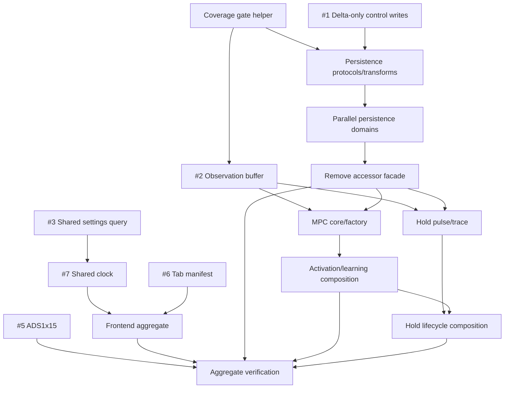

# Parallel Refactor Program Implementation Plan

> **For agentic workers:** REQUIRED SUB-SKILL: Use superpowers:subagent-driven-development (recommended) or superpowers:executing-plans to implement this plan task-by-task. Steps use checkbox (`- [ ]`) syntax for tracking.

**Goal:** Complete cleanup opportunities #1, #2, #3, #5, #6, #7, #8, #9, and #10 with clean caller migrations, parallel execution where contracts permit it, and greater than 90% per-file branch coverage for the final Hold, MPC, and persistence modules.

**Architecture:** Six executable slice plans establish narrow control/runtime/frontend/hardware seams first, split persistence second, then decompose MPC and Hold against those stable seams. Independent slices run in parallel; dependent slices start only after their consumed interfaces land. The end state removes obsolete merge/facade code instead of preserving aliases.

**Tech Stack:** Python 3.14, Flask, SQLite, Pydantic, pytest/pytest-xdist/pytest-cov, React 19, TypeScript, React Router, TanStack Query, Bun/Rstest, Ruff, Pyright/TypeScript LSP, Jujutsu.

## Global Constraints

- Implement the approved design in `docs/superpowers/specs/2026-08-12-parallel-refactor-program-design.md`.
- Use LSP `references`, `rename`, and `rename_file` before every exported-symbol change or cross-file move; do not perform cross-file renames with text replacement.
- Use Jujutsu only for VCS operations. Keep each task as one reviewable change and leave a fresh empty `@` above completed work.
- Preserve behavior and wire formats. Add no compatibility aliases, deprecated re-exports, parallel code paths, or forwarding facades in the final state.
- Opportunity #8, #9, and #10 final modules must each have **strictly greater than 90.0% branch coverage**, measured per file from coverage.py JSON.
- A module absent from coverage JSON fails the gate. A module with zero branches counts as 100% branch coverage.
- Tests must exercise behavior and real failure branches; source-text assertions and mocks that bypass the moved contract do not satisfy coverage.
- Do not edit generated Acados files, generated TypeScript contracts, evidence artifacts, persisted wizard module names, or unrelated UI.
- Run focused tests inside slice tasks. Run aggregate lint/build/full-suite/smoke gates once in the final integration task.

## Slice Plans

| Slice | Opportunities | Plan |
|---|---:|---|
| A | #1, #2 | `docs/superpowers/plans/2026-08-12-control-runner-foundations.md` |
| B | #3, #6, #7 | `docs/superpowers/plans/2026-08-12-frontend-settings-clock.md` |
| C | #5 | `docs/superpowers/plans/2026-08-12-ads1x15-consolidation.md` |
| D | #10 | `docs/superpowers/plans/2026-08-12-persistence-domain-split.md` |
| E | #9 | `docs/superpowers/plans/2026-08-12-mpc-runtime-decomposition.md` |
| F | #8 | `docs/superpowers/plans/2026-08-12-hold-mode-decomposition.md` |

Slice D's exhaustive caller assignment and sequential cutover order are in `docs/superpowers/plans/2026-08-12-persistence-import-migration.md`.

## Fixed Cross-Slice Interfaces

- Slice A produces `ObservationOutcomeBuffer` and delta-only `write_control_snapshot` / `enqueue_control_delta` operations.
- Slice D consumes Slice A's delta-only control contract and produces typed persistence protocols, domain modules, and shared pure transformations.
- Slice E consumes Slice D's model-evidence persistence protocol and produces `MpcCore`, `MpcPairFactory`, `MpcCalibrationRuntime`, `GreyLearningRuntime`, `ActivationRuntime`, and `controller/runtime/model_lifecycle.py` behind `controller.mpc.Controller`.
- Slice F consumes Slice A's observation buffer and the following Slice E-owned runner lifecycle protocol; it does not import private implementation members from `controller.mpc`:

```python
class ModelLifecycleRunner(Protocol):
    def restore_activation(
        self,
        persisted: ModelActivationState,
        records: Sequence[ModelEvidenceRecord],
    ) -> bool: ...
    def activation_runtime_failure(self, reason: str) -> bool: ...
    def rollback_activation(self, reason: str) -> bool: ...
    def drain_activation_events(self) -> tuple[ModelEvidenceRecord, ...]: ...
    def submit_activation_confidence(
        self, record: ModelEvidenceRecord
    ) -> DurableActivationReceipt | None: ...
    def stop_for_refit(self) -> bool | None: ...
    def finalize_cook_refit(self, outcome: TeardownRefitOutcome) -> bool: ...
    def finish_teardown(self) -> None: ...
```

`drain_activation_events` transfers an immutable ordered batch and clears only delivered events. The runner owns active/rollback/retained cores: `stop_for_refit` joins execution but may retain the core; `finalize_cook_refit` never closes it; `finish_teardown` closes retained resources exactly once and is called from Hold's teardown `finally` after persistence flush/finalization. Confidence submission copies/queues the record and returns the durability receipt without transferring a close obligation.
- Slices B and C have no dependency on D–F and may merge at any point after their own gates pass.

## Parallel Wave Schedule



### Wave 1 — Run in parallel

- [ ] Execute Slice A Task 1: install exact branch-coverage gate tooling.
- [ ] Execute Slice A Tasks 2–4: characterize and remove legacy merge writes.
- [ ] Execute Slice A Tasks 5–7: extract and integrate `ObservationOutcomeBuffer`.
- [ ] Execute Slice B Tasks 1–3 (base-aware settings query) in parallel with Slice B Tasks 4–6 (typed settings-tab manifest).
- [ ] After Slice B Task 3 lands, execute Slice B Task 7: shared clock cutover; it shares `Dashboard.tsx` and `Dashboard.test.tsx` with Task 3.
- [ ] Execute Slice C completely: shared ADS1x15 implementation and both thin adapters.

`#1` and `#2` may run concurrently because they touch separate modules except their final focused runtime run. Within Slice B, #3 and #6 may run concurrently after Task 1 records current contracts. #7 follows #3 because both edit Dashboard production/tests; it remains independent of #6.

### Wave 2 — Persistence

- [ ] Execute Slice D Tasks 1–2 sequentially: characterize transactions, install protocols and pure transformations.
- [ ] Execute Slice D Tasks 3–7 in parallel: create and test control, runtime, history, trace, and install-state destination modules; inventory callers but do not edit shared import statements or `common/datastore_accessors.py`.
- [ ] Execute Slice D Tasks 8–9 sequentially: model-evidence transactions/policy inversion and runtime store composition.
- [ ] Execute Slice D Task 10: migrate every caller in one sequential cutover and remove `common/datastore_accessors.py`.
- [ ] Execute Slice D Task 11: per-file >90% branch gate and focused persistence integration.

### Wave 3 — Parallel MPC/Hold extraction

After Slice D contracts land:

- [ ] Execute Slice E Tasks 1–4: MPC contract baseline, core, factory, and calibration extraction.
- [ ] In parallel, execute Slice F Tasks 1–4: Hold contract baseline, framed pulse runtime, trace session, and thin integration.

The Wave 3 workers must not both edit `controller/runtime/runner.py`. Slice E Task 5 later types the existing lifecycle methods without adding a second dispatch path; Slice F Tasks 1–5 consume existing runner behavior and do not edit the runner.

### Wave 4 — Lifecycle composition

- [ ] Execute Slice E Task 5 first: land the typed runner lifecycle protocol and activation runtime.
- [ ] In parallel, execute Slice E Tasks 6–8 (grey learning, Flask activation service, thin plugin) and Slice F Task 5 (observation/evidence reconciliation).
- [ ] After Slice E Task 8 exposes the final plugin lifecycle surface, execute Slice E Task 9 and Slice F Tasks 6–8.
- [ ] Execute Slice F Task 9: pass >90% branch gates and framed Hold smoke.

Slice F Task 6 is the first Hold task allowed to consume the typed activation/refit lifecycle protocol.

### Wave 5 — Aggregate integration

- [ ] Rebase completed slice changes onto one integration head using Jujutsu; resolve conflicts by preserving the fixed interfaces above, not by retaining both implementations.
- [ ] Use LSP workspace diagnostics for Python and TypeScript. Resolve every diagnostic introduced by the program.
- [ ] Run the aggregate #8–#10 coverage command and enforce every named file with `scripts/check_branch_coverage.py`.
- [ ] Run focused frontend tests and `bun run build` from `web-react/`.
- [ ] Run focused Python control/runtime/MPC/Hold/persistence/probe suites.
- [ ] Run `uv run ruff format --check` and `uv run ruff check` over changed Python files.
- [ ] Run the repository Python suite with the project defaults.
- [ ] Run `uv run python tools/smoke_acados_hold.py`; require successful framed Hold startup, update, applied-output feedback, and teardown.
- [ ] Inspect the final changes with `jj --no-pager diff --git`; verify no compatibility aliases, duplicate implementations, generated changes, or unrelated formatting.
- [ ] Describe the integration change, open a fresh empty `@`, and do not move bookmarks or push unless explicitly requested.

## Aggregate Coverage Command

The exact final module list is maintained in Slice D/E/F and passed explicitly:

```bash
uv run pytest -q \
  tests/unit/runtime/test_hold_*.py \
  tests/unit/runtime/test_threaded_runner.py \
  tests/unit/runtime/test_framed_pulse_runtime.py \
  tests/unit/runtime/test_control_trace_session.py \
  tests/unit/mpc \
  tests/unit/common/test_model_evidence_store.py \
  tests/unit/persistence \
  tests/web/test_api_model_evidence.py \
  tests/unit/datastore \
  --cov=common.persistence \
  --cov=common.persistence.protocols \
  --cov=common.persistence.transforms \
  --cov=common.persistence.control \
  --cov=common.persistence.runtime \
  --cov=common.persistence.history \
  --cov=common.persistence.control_trace \
  --cov=common.persistence.model_evidence \
  --cov=common.persistence.install_state \
  --cov=controller.model_learning.migration \
  --cov=controller.mpc \
  --cov=controller.mpc_config \
  --cov=controller.mpc_core \
  --cov=controller.mpc_factory \
  --cov=controller.mpc_calibration \
  --cov=controller.model_learning.activation_runtime \
  --cov=controller.model_learning.grey_runtime \
  --cov=controller.model_learning.activation_service \
  --cov=controller.runtime.model_lifecycle \
  --cov=controller.runtime.framed_pulse \
  --cov=controller.runtime.control_trace_session \
  --cov=controller.runtime.modes.hold_learning \
  --cov=controller.runtime.modes.hold \
  --cov-branch --cov-report=json:.coverage-refactor.json

uv run python scripts/check_branch_coverage.py \
  --coverage .coverage-refactor.json --minimum 90 \
  common/persistence/__init__.py \
  common/persistence/protocols.py \
  common/persistence/control.py \
  common/persistence/runtime.py \
  common/persistence/history.py \
  common/persistence/control_trace.py \
  common/persistence/model_evidence.py \
  common/persistence/install_state.py \
  common/persistence/transforms.py \
  controller/model_learning/migration.py \
  controller/mpc.py \
  controller/mpc_config.py \
  controller/mpc_core.py \
  controller/mpc_factory.py \
  controller/mpc_calibration.py \
  controller/model_learning/activation_runtime.py \
  controller/model_learning/grey_runtime.py \
  controller/model_learning/activation_service.py \
  controller/runtime/model_lifecycle.py \
  controller/runtime/framed_pulse.py \
  controller/runtime/control_trace_session.py \
  controller/runtime/modes/hold_learning.py \
  controller/runtime/modes/hold.py
```

Expected: every listed module reports branch coverage greater than 90.0%; command exits 0. If final implementation creates an additional Hold, MPC, or persistence module, append it to this gate rather than leaving it unmeasured.
