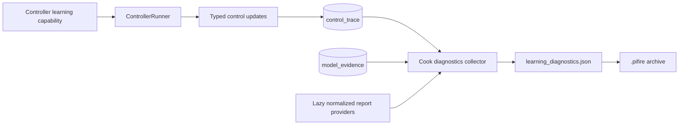

# Cookfile Learning Diagnostics Design

**Date:** 2026-08-23  
**Status:** Approved in chat; pending written-spec review

## 1. Goal

Every newly written `.pifire` cookfile must be a self-contained learning postmortem for PID-SP, MPC, and future learning-capable controllers. A shared archive contract must retain the complete per-cook diagnostic history needed to explain why learning collected, rejected, fitted, activated, fell back, or failed.

The cookfile writer must not contain PID-SP or MPC branches. Controller-specific code owns only the production of its learning snapshot and normalized report. Shared trace, evidence, collection, validation, and archive code owns everything else.

## 2. Required outcomes

A downloaded cookfile must let an engineer determine:

1. which controllers and controller generations ran during the cook;
2. the controller configuration and software/schema versions in force;
3. the ordered measured inputs, requested outputs, allocations, physical application, safety inhibition, and feedback;
4. the learning state aligned with each completed controller update;
5. the complete cook-scoped learning evidence and lifecycle decisions;
6. the final normalized report/checkpoint state for each learning-capable controller seen during the cook;
7. whether any diagnostic source failed during capture.

A cook that switches between PID-SP and MPC must retain both histories. Current settings at Stop are not a valid substitute for the controllers that actually ran.

## 3. Non-goals

- No learning-diagnostics dashboard or cookfile UI is added.
- No raw SQLite rows or database files are embedded.
- No second controller trace, evidence store, or per-controller archive format is introduced.
- No historical cookfile is backfilled with data that was never captured.
- No diagnostic failure may block shutdown, cookfile creation, or history cleanup.
- No arbitrary cap or summary-only policy may silently discard cook-scoped records.

## 4. Existing authorities

The design extends existing ownership rather than creating parallel telemetry:

- `common.control_trace.ControlTraceRecord` is the typed, cook-identified control history for PID, PID-SP, and MPC.
- `common.persistence.control_trace.read_control_trace_cook()` returns one cook in insertion order.
- `common.model_evidence.ModelEvidenceRecord` and `common.persistence.model_evidence.read_model_evidence(cook_id=...)` own MPC learning evidence and lifecycle records.
- `controller.learning_report` is the lazy selected-controller report boundary.
- `controller.pid_sp_learning` and `controller.model_learning.report` own normalized PID-SP and MPC reports.
- metrics `id` is the stable `cook_id` already copied into trace and evidence records.
- `file_mgmt.cookfile.create_cookfile()` is the sole cookfile creation boundary and runs before history/metrics are flushed.

The current control trace already captures controller configuration, build/schema versions, setpoint, temperatures, requested and realized output, safety provenance, PID-SP predictor terms, MPC state/model/allocation data, and session/controller identity. The missing pieces are an explicit generic learning snapshot on each control update and export of the existing cook-scoped authorities into the cookfile.

## 5. Architecture



### 5.1 Controller capability

Add a controller-neutral capability returning either an immutable, JSON-safe snapshot or `None`:

```python
@dataclass(frozen=True, slots=True)
class ControllerLearningDiagnostics:
    schema_version: int
    state: Mapping[str, JsonValue]


class ControllerBase:
    def get_learning_diagnostics(self) -> ControllerLearningDiagnostics | None:
        return None
```

`ControllerRunner` exposes the capability without inspecting controller-specific status dictionaries.

PID-SP returns schema 1 around its existing normalized identifier/predictor/gate/confirmation state. MPC returns schema 1 around `GreyLearningRuntime.learning_status()`. Their existing `get_status()` methods reuse the same owned snapshot rather than rebuilding a second representation.

The returned mapping is deep-owned at the capability boundary. Mutating a caller-owned copy cannot mutate the controller or a later trace record. NaN, infinity, non-string keys, and non-JSON values are rejected by typed trace validation.

### 5.2 Control-trace integration

Advance `TRACE_SCHEMA_VERSION` from 5 to 6. Add this optional field to the common control-update payload shared by PID, PID-SP, and MPC:

```python
learning: LearningSnapshotPayload | None
```

`LearningSnapshotPayload` contains:

```json
{
  "schema_version": 1,
  "state": {}
}
```

Every accepted completed controller update reads the capability once and records the exact returned snapshot beside the update's existing setpoint, measurement, output, timing, generation, and provenance. Controllers without learning record `null`.

This is not a new event stream. It enriches the existing typed update record so ordering and causality cannot diverge. Replay accepts schema-6 records, preserves the snapshot, and continues to report older/incompatible schemas according to the existing explicit schema policy.

### 5.3 Final report dispatch

Extend `controller.learning_report` with a lazy generic report function:

```python
controller_learning_report(controller_name: str) -> ControllerLearningReport | None
```

The returned envelope contains controller name, provider schema version, revision, and an owned JSON report. A provider registry maps supported controller names to lazy module/function lookups. The cookfile collector and callers never import or branch on PID-SP/MPC modules.

The existing revision-only function delegates to the same provider boundary. Unsupported controllers return `None` without importing any learning provider.

For MPC, the provider returns the normalized report only; cook-scoped evidence is exported separately from the evidence authority. For PID-SP, the provider returns its normalized report/checkpoint projection.

## 6. Cookfile member contract

Every new cookfile includes an optional-at-read, mandatory-at-write member named `learning_diagnostics.json`.

Envelope schema 1:

```json
{
  "schema_version": 1,
  "cook_id": "stable metrics cook UUID",
  "captured_at_ms": 1787490000000,
  "controllers": ["pid_sp", "mpc"],
  "reports": [
    {
      "controller": "pid_sp",
      "schema_version": 1,
      "revision": "sha256 revision",
      "report": {}
    }
  ],
  "control_trace": {
    "record_schema_versions": [6],
    "records": []
  },
  "model_evidence": {
    "record_schema_versions": [3],
    "records": []
  },
  "capture_errors": []
}
```

### 6.1 Envelope invariants

- `schema_version` is exactly 1.
- `cook_id` is the non-blank metrics identity for the archived cook, or `null` only when metrics identity validation failed and `capture_errors` contains `cook-identity-invalid`.
- `captured_at_ms` is a non-negative wall-clock integer taken once at collection.
- `controllers` is the ordered first-seen unique controller list derived from trace session records, never current settings.
- `reports` contains at most one final normalized report for each learning-capable controller in `controllers`, in controller first-seen order.
- `control_trace.record_schema_versions` is the sorted unique set present in `records`; every record is a validated `ControlTraceRecord` for the exact non-null `cook_id`, in database insertion order. Compatible older records remain included rather than being dropped during an in-cook software transition.
- `model_evidence.record_schema_versions` is the sorted unique set present in `records`; every record is a validated `ModelEvidenceRecord` for the exact non-null `cook_id`, in database insertion order. Compatible evidence schema versions remain included.
- `capture_errors` contains only structured source failures; absence is represented by an empty array, never a missing field.
- JSON serialization is deterministic, rejects non-finite numbers, and uses model-owned JSON output rather than object reprs.

### 6.2 Capture error contract

```json
{
  "source": "control_trace | model_evidence | report:<controller>",
  "code": "stable-machine-readable-code",
  "detail": "operator-readable detail"
}
```

Sources are read and validated independently. A failed source contributes an empty result for that source plus one error entry. Other successfully captured sources remain present.

The collector logs one events warning per failed source. It never raises a source-specific capture failure into `create_cookfile()`. If the collector itself cannot construct even the envelope, cookfile creation writes a minimal valid envelope with a `collector` error. The primary archive still completes.

## 7. Generic collector ownership

Add a focused collector module outside controller-specific packages. Its public function accepts `cook_id: str | None` and injected source/provider callables for deterministic tests, then returns a validated diagnostics envelope.

The production composition performs:

1. read all typed trace records for `cook_id`;
2. derive ordered controllers from session records;
3. read all typed model-evidence records for `cook_id`;
4. request one final report for each derived controller through the generic dispatcher;
5. validate source identity/order/schema invariants;
6. return an owned envelope.

`file_mgmt.cookfile` calls only this function. It does not know controller names, trace event details, evidence kinds, provider modules, or learning report shapes.

If no trace session exists, `controllers` and `reports` are empty and `capture_errors` names the missing trace context. The bundle is still written; silent absence is prohibited.

## 8. Cookfile lifecycle integration

`create_cookfile()` already reads metrics and history before `flush_history()`. It validates one stable cook identity across the session's metrics rows, captures diagnostics before the flush, adds `learning_diagnostics` to the in-memory cookfile structure, and writes `learning_diagnostics.json` with the other JSON members.

A missing or mixed metrics identity is invalid. The collector receives `None`, performs no trace/evidence reads under a guessed identity, and writes `cook_id: null` plus a structured `cook-identity-invalid` error while retaining normal cook data.

`read_cookfile()` loads the member when present and returns `learning_diagnostics: None` when absent. Required legacy members retain their current strict behavior.

`upgrade_cookfile()` does not fabricate diagnostics for old archives. Existing archive update/repair code must preserve the optional member byte-for-byte unless explicitly updating that member.

## 9. Compatibility

The manifest cookfile version remains `1.5.0`. That value is currently used as the minimum readable version. Advancing it for an optional member would incorrectly classify every existing 1.5 cookfile as requiring upgrade.

Compatibility rules:

- old readers ignore the extra ZIP member;
- new readers accept old files without the member and return `None`;
- new writers always emit the member, including for controllers with no learning capability;
- comments, titles, thumbnails, assets, repair, and upgrade operations preserve the member;
- no synthetic trace/evidence/report is generated for old cookfiles.

The diagnostics envelope and contained trace/evidence schema versions provide their own evolution boundaries independently of the legacy minimum-readable cookfile version.

## 10. Size, performance, and retention

The selected policy is complete per-cook diagnostics:

- no row-count sampling or summary cap is applied during export;
- all records are already bounded to one cook identity and written at Stop;
- ZIP deflation compresses repeated field names and slowly changing learning state;
- capture runs off the control hot path after actuators are terminally off;
- source reads remain ordered SQLite index reads by `cook_id`;
- no new long-lived in-memory buffer or database table is added.

Database trace retention remains 30 days. Immediate cookfile export makes the archive durable before later pruning. Persistence gaps remain explicit typed gap records or capture errors; they are never filled with invented data.

## 11. Security and privacy

The bundle includes controller configuration already allowed by the trace design, learned model parameters, temperatures, output history, and diagnostic errors. It excludes unrelated settings, credentials, network configuration, notification destinations, and secrets.

The generic capability accepts only JSON-safe learning state. It cannot expose arbitrary object attributes or serialize a controller instance.

## 12. Access behavior

This change does not render diagnostics in the dashboard or cookfile UI. Downloaded/shared `.pifire` archives contain the member, and full cookfile reads expose it.

History list/detail routes must not begin returning the full diagnostics payload unless they already request the complete archive. A future diagnostic viewer or support tool can consume the versioned member without changing the capture format.

## 13. Verification

Required TDD contracts:

1. PID-SP and MPC capabilities return schema-versioned, deep-owned JSON snapshots; ordinary PID returns `None`.
2. Trace schema 6 round-trips learning snapshots and rejects non-finite/non-JSON state.
3. Each PID-SP/MPC control update records the capability exactly once and aligns it with that update's generation and timestamps.
4. Trace replay preserves valid learning snapshots and handles older/incompatible schema according to existing policy.
5. The report dispatcher remains lazy, returns owned normalized reports for both providers, and avoids imports for unsupported controllers.
6. The collector preserves exact trace/evidence insertion order and rejects cross-cook records.
7. A controller-switch cook derives both controllers and exports both reports.
8. PID-SP cook bundles contain its evolving snapshots even when evidence is empty.
9. MPC cook bundles contain snapshots, complete model evidence, lifecycle events, and final report.
10. One failed source yields a structured `capture_errors` entry without dropping successful sources.
11. Total collector failure still produces a valid minimal member and does not prevent normal cookfile creation/history flush.
12. New archives contain `learning_diagnostics.json`; legacy archives read with `None`.
13. Cookfile comment/title/asset/repair operations preserve the member.
14. New or substantially rewritten collector/provider modules exceed 90% branch coverage.
15. The focused safety, Hold, PID-SP, MPC, persistence, cookfile, web, full Python, and full JavaScript suites remain green.

## 14. Rollout

This is a clean cutover for new cookfiles. There is no feature flag and no controller-specific setting. Trace schema advances once, new cookfiles always include the diagnostics member, and old cookfiles remain readable without fabricated data.
